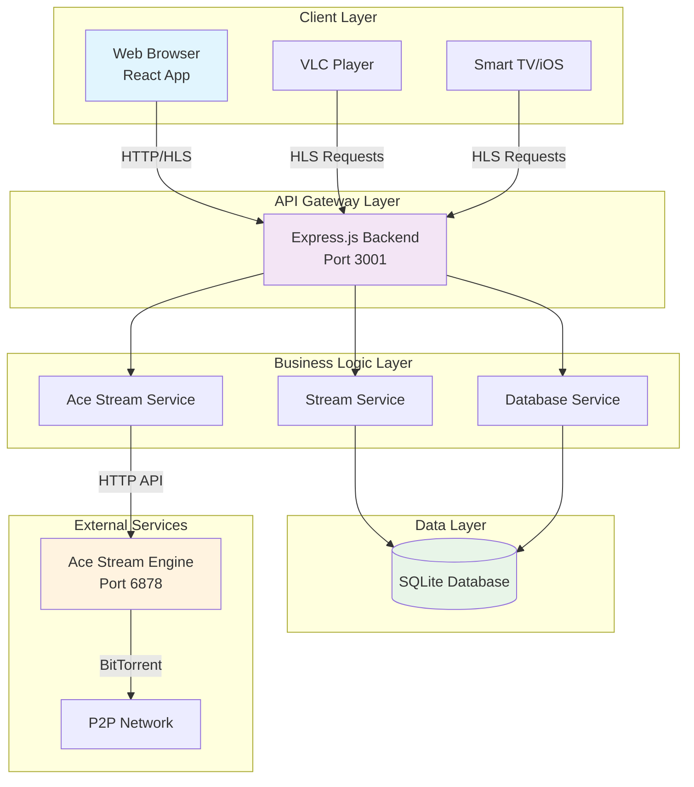
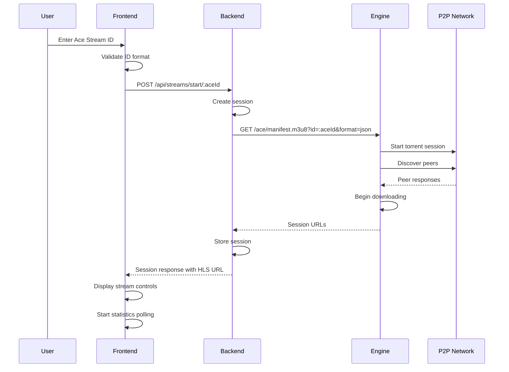
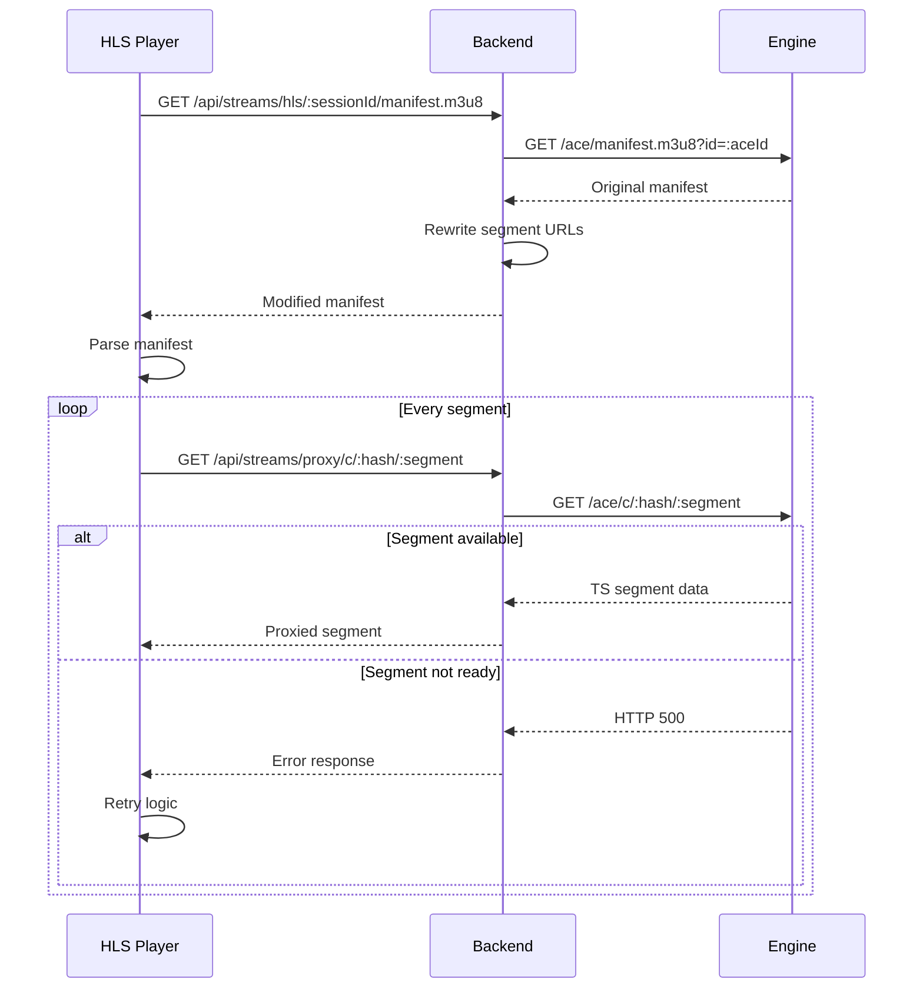
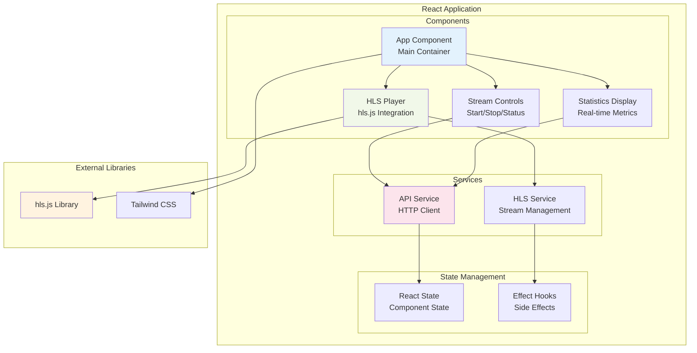
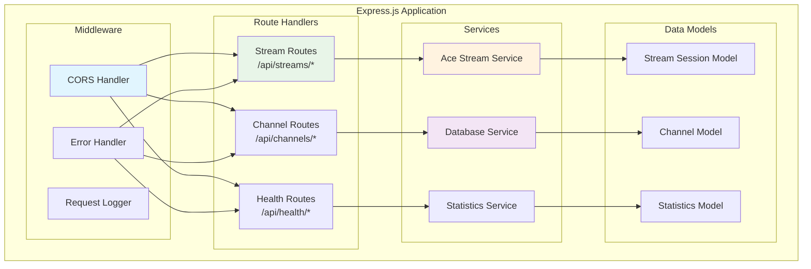
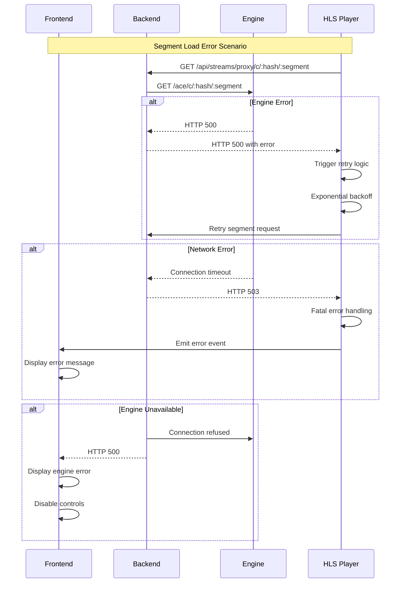
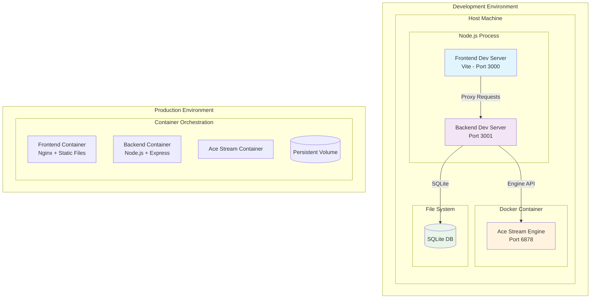
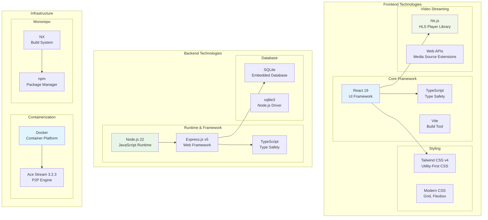
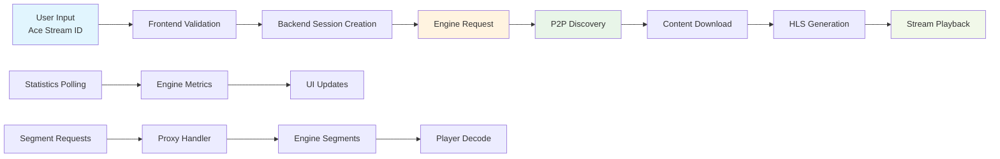
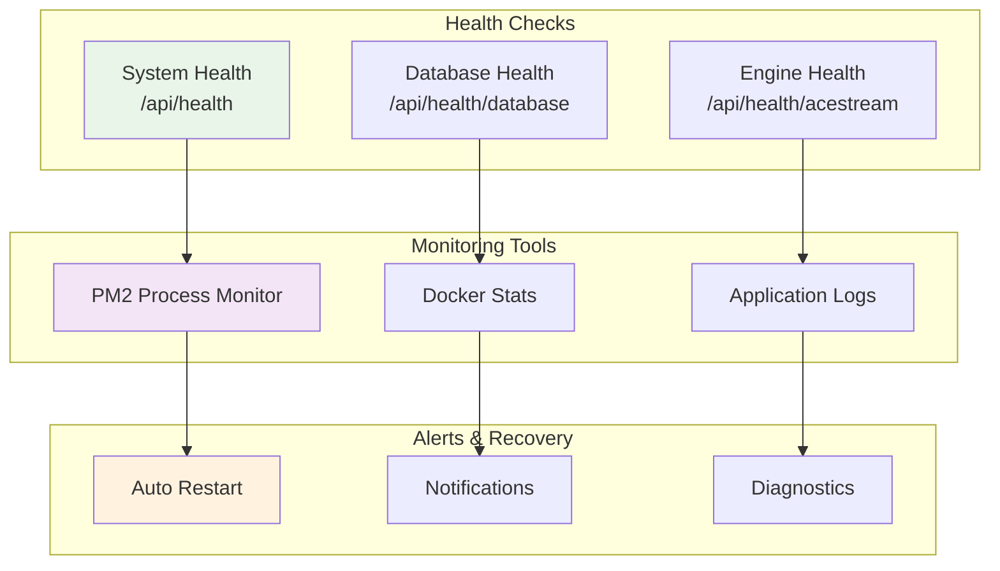

# System Diagrams

This page contains all the architectural and flow diagrams for the Ace Stream HLS system.

## High-Level System Architecture

## Stream Initialization Sequence

## HLS Playback Flow

## Frontend Component Architecture

## Backend Service Architecture

## Error Handling Flow

## Deployment Architecture

## Technology Stack

## Data Flow Overview

## System Health Monitoring

These diagrams provide comprehensive visual documentation of the Ace Stream HLS system architecture, data flows, and component interactions.
